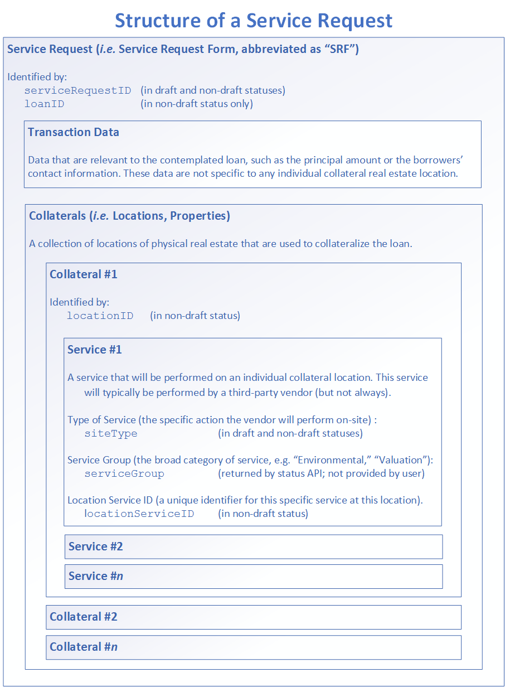

# API List

This section contains a systematic list of all API endpoints
supported by the LOS API.

* [OAuth2 API](api-list/oauth-api.md)
  * <span style="background-color: #ebb747; font-weight: bold; color: #ffffff; padding: 0px 20px; border-radius: 14px;">(POST)</span> /api/v1.1/oauth/token
* [Service Request Fields API](api-list/srf-fields-api.md)
  * <span style="background-color: #72b566; font-weight: bold; color: #ffffff; padding: 0px 20px; border-radius: 14px;">(GET)</span> /api/v1.1/serviceRequest/fields
* [Collateral Overview Fields API](api-list/srf-fields-co-api.md)
  * <span style="background-color: #72b566; font-weight: bold; color: #ffffff; padding: 0px 20px; border-radius: 14px;">(GET)</span> /api/v1.1/serviceRequest/co/fields
* [Service Request API](api-list/srf-api.md)
  * <span style="background-color: #ebb747; font-weight: bold; color: #ffffff; padding: 0px 20px; border-radius: 14px;">(POST)</span> /api/v1.1/serviceRequest/form
  * <span style="background-color: #5493dc; font-weight: bold; color: #ffffff; padding: 0px 20px; border-radius: 14px;">(PUT)</span> /api/v1.1/serviceRequest/form
* [Service Request Status API](api-list/srf-status-api.md)
  * <span style="background-color: #72b566; font-weight: bold; color: #ffffff; padding: 0px 20px; border-radius: 14px;">(GET)</span> /api/v1.1/serviceRequest/status/serviceRequestID/:serviceRequestID
  * <span style="background-color: #72b566; font-weight: bold; color: #ffffff; padding: 0px 20px; border-radius: 14px;">(GET)</span> /api/v1.1/serviceRequest/status/loanID/:loanID
  * <span style="background-color: #72b566; font-weight: bold; color: #ffffff; padding: 0px 20px; border-radius: 14px;">(GET)</span> /api/v1.1/serviceRequest/status/locationID/:locationID
* [Service Request File List API](api-list/srf-file-list-api.md)
  * <span style="background-color: #72b566; font-weight: bold; color: #ffffff; padding: 0px 20px; border-radius: 14px;">(GET)</span> /api/v1.1/serviceRequest/files/list/serviceRequestID/:serviceRequestID
  * <span style="background-color: #72b566; font-weight: bold; color: #ffffff; padding: 0px 20px; border-radius: 14px;">(GET)</span> /api/v1.1/serviceRequest/files/list/loanID/:loanID
  * <span style="background-color: #72b566; font-weight: bold; color: #ffffff; padding: 0px 20px; border-radius: 14px;">(GET)</span> /api/v1.1/serviceRequest/files/list/locationID/:locationID
* [Service Request File Download API](api-list/srf-file-download-api.md)
  * <span style="background-color: #72b566; font-weight: bold; color: #ffffff; padding: 0px 20px; border-radius: 14px;">(GET)</span> /api/v1.1/serviceRequest/files/download/:uploadID
* [Service Request File Upload API](api-list/srf-file-upload-api.md)
  * <span style="background-color: #ebb747; font-weight: bold; color: #ffffff; padding: 0px 20px; border-radius: 14px;">(POST)</span> /api/v1.1/serviceRequest/files/upload/locationID/:locationID/uploadedBy/:uploadedBy
* [Utilities API](api-list/utilities/list.md)
  * [Utilities API: Service Types](api-list/utilities/service-types.md)
    * <span style="background-color: #72b566; font-weight: bold; color: #ffffff; padding: 0px 20px; border-radius: 14px;">(GET)</span> /api/v1.1/utilitiy/serviceTypes
  * [Utilities API: Document Types](api-list/utilities/document-types.md)
    * <span style="background-color: #72b566; font-weight: bold; color: #ffffff; padding: 0px 20px; border-radius: 14px;">(GET)</span> /api/v1.1/utilitiy/documentTypes
  * [Utilities API: Document Status](api-list/utilities/document-status.md)
    * <span style="background-color: #72b566; font-weight: bold; color: #ffffff; padding: 0px 20px; border-radius: 14px;">(GET)</span> /api/v1.1/utilitiy/documentStatus

## Conventions

API endpoints are listed as URL paths. Hostnames are omitted,
while any query string parameters are listed separately.

Certain parts of a URL may contain variable data meant to be
selected by the client application. In these cases, the variables
will be prefixed by a colon (":"). For example, in the following
URL, the value `:variable` is a variable:

```
/example/url/path/:variable
```

When this variable is replaced by an actual value in your
API requests, do not include the leading colon. For example,
the preceding URL would look like so with the variable replaced
by the value `123`:

```
/example/url/path/123
```

For each endpoint, the supported HTTP methods are indicated like so:

  * <span style="background-color: #72b566; font-weight: bold; color: #ffffff; padding: 3px 10px; border-radius: 14px;">GET</span>

  * <span style="background-color: #ebb747; font-weight: bold; color: #ffffff; padding: 3px 10px; border-radius: 14px;">POST</span>

  * <span style="background-color: #5493dc; font-weight: bold; color: #ffffff; padding: 3px 10px; border-radius: 14px;">PUT</span>

## Structure of a Service Request

Many of the LOS API's endpoints relate to (or operate on) service
requests in Collateral 360. As described earlier in this document,
a service request contains basic information about a contemplated
loan (often referred to as the "transaction data"), as well as a
list of real estate locations that will be used as collateral.
Finally, each such collateral location usually has a list of services
to be performed at that location (such as an appraisal, a specific
type of environmental study, completion of a document, _etc._).

The following diagram can be used to readily visualize the
relationships between the various components of a service request.
Major identifiers used by the LOS API at each level are also included
for reference and clarification.


